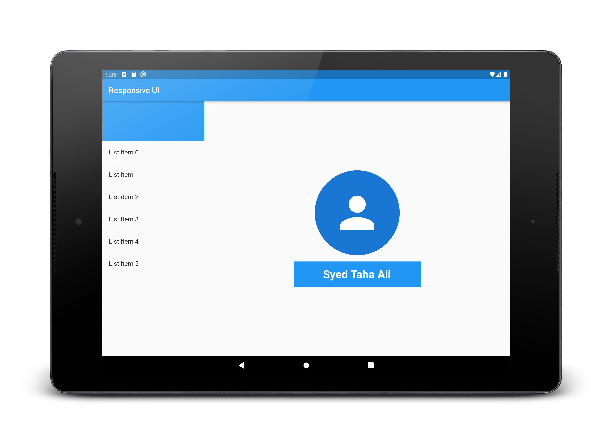
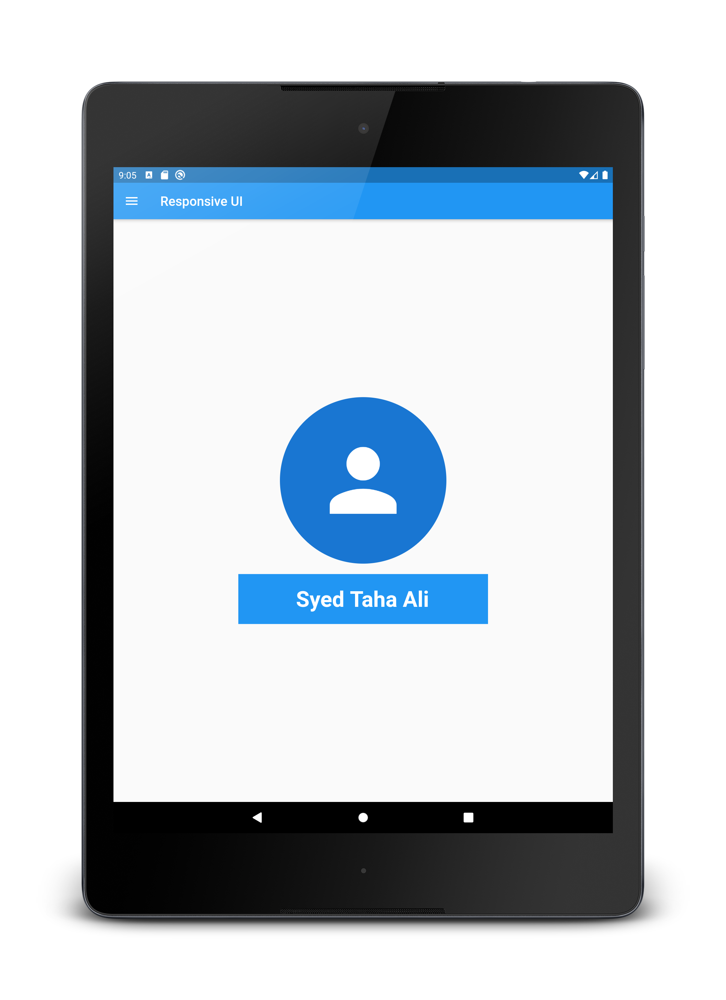

# Flutter Training - Session 9

Explored techniques to make UI responsive to different screen sizes. There are two main approaches, which make use of MediaQuerry and LayoutBuilder class. Other than that widgets such as FittedBox, AspectRatio, OrientationBuilder also facilitate in building responsive UI.

## Description

This is a sample application with responsive page design that adapts to different screen sizes and orientations. The page will contain a list view that will be hidden inside a drawer in portrait mode and in landscape mode that list will share ⅓ of the screen’s width.

## Application

Landscape             |  Portrait
:-------------------------:|:-------------------------:
  |  

